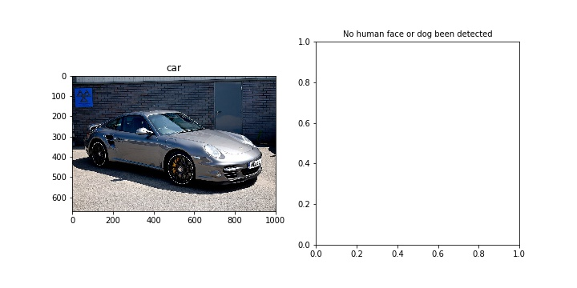

 
## Project: Write an Algorithm for a Dog Breed Identification App 

### The goals / steps of this project are the following:

In this notebook, it is required to make the first steps towards developing an algorithm that could be used as part of a mobile or web app.  At the end of this project, the finished code will accept any user-supplied image as input and do detections:<br>
* If a dog is detected in the image, it will provide an estimate of the dog's breed, therefore it needs two classification: **`dog-vs-non_dog`** , and **`dog breed`** classification.  
* If a human is detected, it will provide an estimate of the dog breed that is most resembling, therefore a **`face-detector`** model is needed. 

### __Steps:__
__1. Datasets import__: The data set is downloaded and put under the same directory as dog_app.ipynb is located. dog images are under the __`dog_images`__ directory, while human face images is under __`lfw`__ directory<br><br>
With data been loaded, the following steps are to define three detectors mentioned above: `human face detector, dog detector and dog breed detector`. For all those three detector, either specific computer vision algorithms or deep neural networks can be used. If neural network, either creating one from scratch or using transfer learning method.<br><br> 
__2. Human face detector definition__: in cell 2 and 3 human face detector based on __`Haar feature-based cascade classifiers`__, this model achieved __`98%`__ and __`18%`__ face detection accuaracy on human face data set and dog data set respectively<br><br>
__3. Dog detector definition__: from cell 6 t0 9, a dog detector using transfer learning is defined based on __`VGG16`__. This model achieved around __`93%`__ and __`0%`__ dog detection accuaracy on dog data set and human face data set  respectively. The final model uses __`inception_v3`__ instead, which showed better performance as __`95%`__ dog detection accuracy<br><br>
__4. Dog breed detector definition__, cell 14 defines a dog breed detector from scratch. It has 3 convolution layers and 2 fully connected layers shown below:<br>

```python
    Net(
      (layer1): Sequential(
        (0): Conv2d(3, 16, kernel_size=(3, 3), stride=(1, 1), padding=(1, 1))
        (1): BatchNorm2d(16, eps=1e-05, momentum=0.1, affine=True, track_running_stats=True)
        (2): ReLU()
        (3): MaxPool2d(kernel_size=2, stride=2, padding=0, dilation=1, ceil_mode=False)
      )
      (layer2): Sequential(
        (0): Conv2d(16, 32, kernel_size=(3, 3), stride=(1, 1), padding=(1, 1))
        (1): BatchNorm2d(32, eps=1e-05, momentum=0.1, affine=True, track_running_stats=True)
        (2): ReLU()
        (3): MaxPool2d(kernel_size=2, stride=2, padding=0, dilation=1, ceil_mode=False)
      )
      (layer3): Sequential(
        (0): Conv2d(32, 64, kernel_size=(3, 3), stride=(1, 1), padding=(1, 1))
        (1): BatchNorm2d(64, eps=1e-05, momentum=0.1, affine=True, track_running_stats=True)
        (2): ReLU()
        (3): MaxPool2d(kernel_size=2, stride=2, padding=0, dilation=1, ceil_mode=False)
      )
      (fc1): Linear(in_features=50176, out_features=200, bias=True)
      (fc2): Linear(in_features=200, out_features=133, bias=True)
      (dropout): Dropout(p=0.3)
    )
```    

 
This model is trained from scratch and achieved around __`11%`__ dog breed detection accuaracy after 25 epochs on dog data set<br><br>
__5. Final model definition__, The final model is based on __`inception_v3`__. The main reasons to choose this model is: a) size is smaller than VGG, and b) better performance on imagenet data set.<br>    
In this model, dog-non-dog classification and dog breed predication are combined into the same inception model by adding one extra fully connected layer called __self.fc_dog_breed__ at the output with size (4086,133), in parallel with the original final fully connected output layer __self.fc__. The detailed steps are shown below:<br>
- Saved torchvision/models/inception.py into a local directory where dog_app.ipynb is located with name as __inception_dog.py__
- Load pretrained parameters:<br> 

The following lines (line 30 to 41) from file  __inception_dog.py__ shows how to load all pretrained parameters except new __self.fc_dog_breed__ layer's<br>
```python
if pretrained:
    if 'transform_input' not in kwargs:
        kwargs['transform_input'] = True
    model = Inception3(**kwargs)
    pretrained_dict = model_zoo.load_url(model_urls['inception_v3_google'])
    model_dict = model.state_dict()
    for name, param in model_dict.items():
        if name not in pretrained_dict:
            continue
        param = pretrained_dict[name].data
        model_dict[name].copy_(param)
    return model
```

The following line (line 72) from __inception_dog.py__ shows how extra layer self.fc_dog_breed is added into __init()__ function
```python
self.fc_dog_breed = nn.Linear(2048, dog_breed_classes)
```

The following lines (Line 135 to 143) in file  __inception_dog.py__ shows how the new layers is added in parrallel with the original output layer
```python
# 1 x 1 x 2048
x = x.view(x.size(0), -1)
x_dog_breed = self.fc_dog_breed(x)           
# 2048
x = self.fc(x)   
# 1000 (num_classes)
if self.training and self.aux_logits:
    return x_dog_breed, x, aux 
return x_dog_breed, x
```
During training, all layers parameters are freezed except added __self.fc_dog_breed.weight__ and __self.fc_dog_breed.bias__. The batch normalization layers running_mean and running_var are also freezed in cell 16 shown below:
```python
if pretrained:
    for module in model.modules():
        if isinstance(module, torch.nn.modules.BatchNorm1d):
            module.eval()
        if isinstance(module, torch.nn.modules.BatchNorm2d):
            module.eval()
        if isinstance(module, torch.nn.modules.BatchNorm3d):
            module.eval()
 ```
 __If not freezing batch normalization layer's running_mean and running_var, these values will be updated when training model for dog-breed classes. These updated running_mean and running_var will reduce model accuracy when doing dog-non-dog classification from 95% to 81%__<br>
 Final model's dog breed prediction accuracy is up to <font color='red'>__85%__</font> after 5 epoch training, while dog-non-dog classification accuracy stays the same as before training, __95%__
 
 ### __Results:__
 #### Performance on dog_images
 Performance is checked on five images from test dataset, two images got from intenet, and three skatched dog pictures<br><br>
 The following five pictures show correct dog breed predictions on the test data 
<figure>
    <figcaption>American water spaniel</figcaption>
    
    <figcaption>Brittany</figcaption>
    
    <figcaption>Curly-coated retriever</figcaption>
     
    <figcaption>Labrador retriever</figcaption>
     
    <figcaption>Welsh springer spaniel</figcaption>
         
    </figure>  
The following two pictures show correct dog breed predictions on pictures got from __internet__
<figure>
    <figcaption>beagle puppy</figcaption>
    
    <figcaption>german shepherd</figcaption>
    
    </figure>    
The following three pictures show correct dog breed predictions on __skatched__ dog pictures 
<figure>
    <figcaption>dalmatian breed</figcaption>
    
    <figcaption>Dog</figcaption>
    
    <figcaption>labrador Retriever </figcaption>
        
    </figure>  
    
#### Performance on human_face
 Performance is checked on two human face images<br><br> 
<figure>
    <figcaption>Aaron Tippin</figcaption>
    
    <figcaption>Aileen Riggin Soule</figcaption>
        
    </figure>   
    
#### Performance on non human_face or dog images
 Performance is checked on five images: 1 car, two cats and two wolves<br><br> 
<figure>
    <figcaption>car</figcaption>
    
    <figcaption>cat</figcaption>
        
    <figcaption>Cute_Cat</figcaption>
    
    <figcaption>wolf</figcaption>
        
    <figcaption>wolves gray</figcaption>
        
    </figure>   
