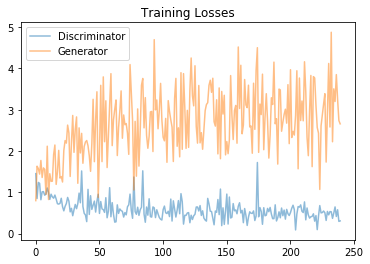
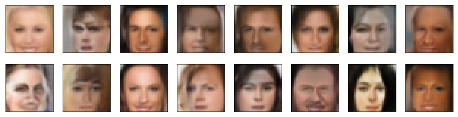

## project-face-generation

### Udacity Deep Learning Nanodegree 

This repository contains code for a Generative Adversarial Network based on the DCGAN Model. The goal of the project is to generate new faces, using the [CelebFaces Attributes Dataset (CelebA)](http://mmlab.ie.cuhk.edu.hk/projects/CelebA.html) training dataset containing over 200k celebrity images.

* **The corresponding loss for both networks:**

* **Image Generated:**

