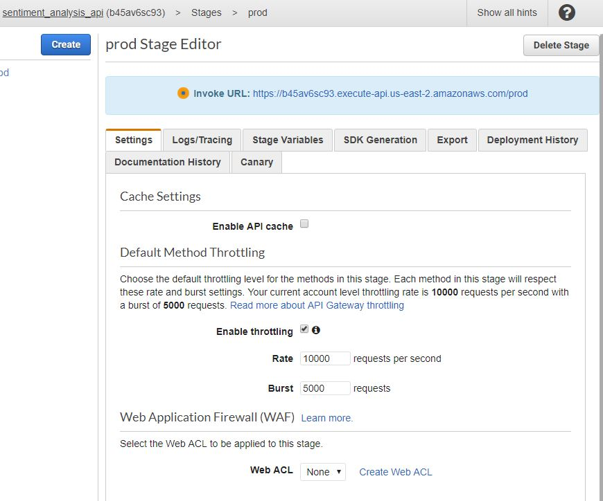
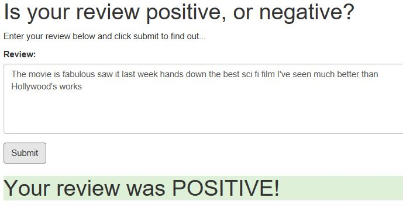
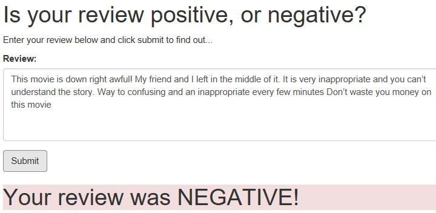

# SageMaker Deployment Project

### Creating a Sentiment Analysis Web App  Using PyTorch and SageMaker

_Deep Learning Nanodegree Program | Deployment_

---
This project is to create a simple web page into which a user can enter a movie review. The web page will then send the review off to the deployed model which will predict the sentiment of the entered review back to web page. 
The model behind this is based on LSTM model deployed on Amazon AWS

----
### General outlines for such NLP application
1. Download or otherwise retrieve the data.
2. Process / Prepare the data.
3. Upload the processed data to S3.
4. Train a chosen model.
5. Test the trained model (typically using a batch transform job).
6. Deploy the trained model.
7. Use the deployed model.

####  1. Download or otherwise retrieve the data
The data used in this project is downloaded from:  [IMDb dataset](http://ai.stanford.edu/~amaas/data/sentiment/)

The downloaded  data has a saved directory hierarchy of `data/pos`, `data/neg`, `test/pos` and `test/neg` with each review as a seperate file. In the next step, all those files are combined into a single python dictionary

#### 2. Process / Prepare the data
* Combine those downloaded reviews data under directories  `data/pos`, `data/neg`, `test/pos` and `test/neg` into a single python dictionary `data` by function **prepare_imdb_data**
* A few preprocessing step are carried on: removing html tags, converting string to lower case, tokenization, removing `stop words` and `Stemming` using `BeautifulSoup` and `nltk` packages in function **review_to_words**
* After all reviews are tokenized, they need to be converted from string format into unique integers, so that they can be used as inputs to LSTM models. To get this, a `word_dict` is created based on training data, with most frequent work has smaller unique integer. This step is done through function **build_dict**
* With `word_dict` all the reviews can be converted into integers sequence representation. Due to LSTM structure, this sequences are padded or truncated to a fixed length500

After this step, both training and testing data are ready for model train

#### 3. Upload the processed data to S3
To train model using Sagemaker, the training data has to be uploaded to a defined place through **sagemaker.Session()**

#### 4. 5. Define and train a LSTM model
In this step, a custom LSTM model is defined, trained and tested before deployment
```python
estimator = PyTorch(entry_point="train.py",
                    source_dir="train",
                    role=role,
                    framework_version='0.4.0',
                    train_instance_count=1,
                    train_instance_type='ml.p2.xlarge',
                    hyperparameters={
                        'epochs': 20,
                        'hidden_dim': 200,
                    })
```
The test accuracy based on trained code is around **85.4%**, a little worse than that of XGBoost, which gives **>86%** 

#### 6. Deploy model for web app access
To deploy a model for web app access, an inference code using trained model artifacts is created and tested

Before deploy this model, two things need to be done: creating **Lambda function** and setting up **API Gateway**

----
**Lambda function setting:**

<figure>
    <figcaption>Lambda Function Setting</figcaption>
    
</figure>


----
**API Gateway setting:**

<figure>
    <figcaption>API Gateway Setting</figcaption>
    
</figure>


#### 7. Result of the deployed model
The following two figures show two example of how the review enterred through web page are processed
<table><tr>
<td><figure>
    <figcaption>positive</figcaption>
    
    </figure></td>
<td><figure>
    <figcaption>negative</figcaption>
    
</figure></td>
</tr></table>
