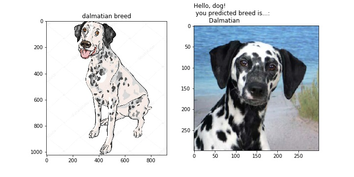
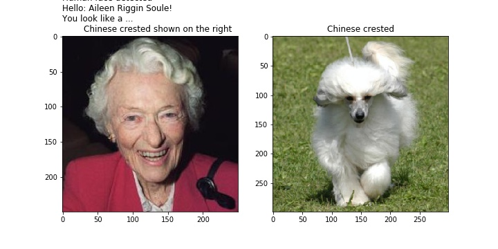
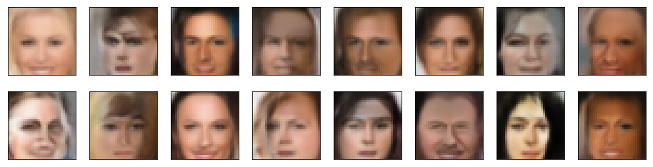
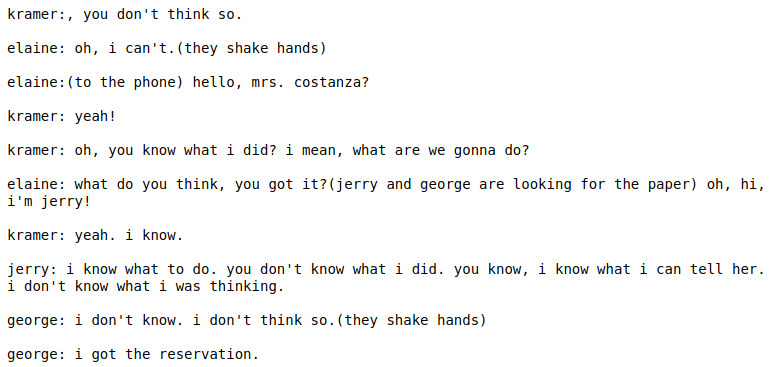
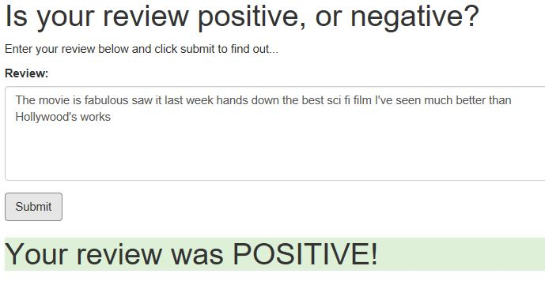
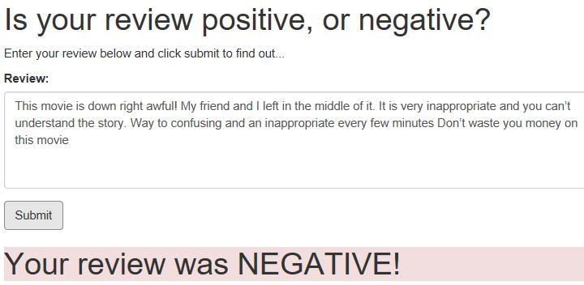

# Deep Learning

---

    
Build convolutional networks for image recognition, recurrent networks for sequence generation, generative adversarial networks for image generation, and learn how to deploy models accessible from a website.

---

## Projects

### [Project 1: Dog Breed Classifier](https://github.com/darrickz/Deep_Learning/tree/master/DLND-Dog-breed-Classifier)

Built Convolutional Neural Networks (CNN) to classify 133 dog breeds using transfer learning
<table><tr>
<td>

<figure>
    
    
Predicted Dog Breed

</figure></td>

<td><figure>    
    
    
Closest Predicted Dog Breed

</figure>
  </td>  </tr></table>

---

### [Project 2: Face Generation](https://github.com/darrickz/Deep_Learning/tree/master/DLND-project-face-generation)

Trained a DCGAN on a dataset of faces.Then new images of faces that look as realistic as possble are generated:

<figure>
    <kbd>
    
    </kbd>
     
    
Generated Face

### [Project 3: Generate TV Script](https://github.com/darrickz/Deep_Learning/tree/master/DLND-project-tv-script-generation)

RNN network is trained to generate Seinfeld TV scripts. The training data are part of the Seinfeld dataset of scripts from 9 seasons. 

<figure>
    <kbd>
    
    </kbd>
    
Generated fake TV script

### [Project 4: CNN Model Deployment](https://github.com/darrickz/Deep_Learning/tree/master/DLND-sagemaker-deployment)

This project is to build a simple web page in which a user can type in a movie review and the trained RNN model behind the scene predicts whether the review is positive or negative. The model is trained on IMDB dataset and deployed using AWS SageMaker

<figure>
    
    
Sagemaker Architecture

</figure>

Example results:
<table><tr>
<td>

<figure>
    <kbd>
    
    </kbd>        
    
Lidar Obstcle Detection

</figure></td>

<td><figure>    
    <kbd>
    
    </kbd>
    
Lidar Obstcle Detection

</figure>
  </td>  </tr></table>
